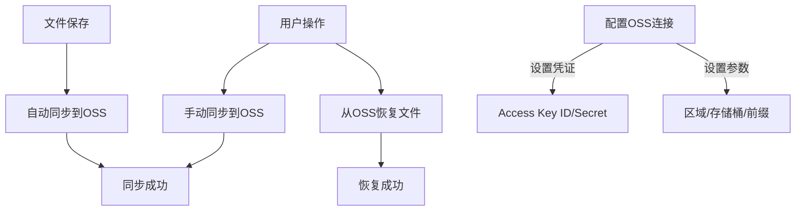

# Obsidian Aliyun Sync Plugin

This plugin allows you to sync your Obsidian notes with Aliyun OSS, including:
- Restoring files from Aliyun OSS to your vault
- Manual store to Aliyun OSS
- Automatic store on file save

## Features

- Restore files from Aliyun OSS to your vault
- Manual store files to Aliyun OSS
- Automatic store on file save
- Configurable OSS connection settings  
- Support for custom prefixes in OSS

## Installation

1. Install from Obsidian's community plugins
2. Enable the plugin
3. Configure your Aliyun OSS credentials in settings

## Usage

### Restore from Aliyun OSS
1. Open the command palette (Ctrl/Cmd+P)
2. Search for "Restore from Aliyun OSS" command
3. Run the command to restore your files

### Manual Sync to Aliyun OSS  
1. Open the command palette (Ctrl/Cmd+P)
2. Search for "Sync to Aliyun OSS" command
3. Run the command to store your files

### Automatic Sync
Files will be automatically synced to Aliyun OSS when saved (can be disabled in settings)

## Configuration

Configure these settings in the plugin settings tab:

- Access Key ID: Your Aliyun OSS Access Key ID
- Access Key Secret: Your Aliyun OSS Access Key Secret  
- Region: OSS region (e.g. oss-cn-hangzhou)
- Bucket: Your OSS bucket name
- Endpoint: Optional custom endpoint
- Prefix: Optional prefix for OSS object keys

## Requirements

- Obsidian v0.15.0 or later
- Valid Aliyun OSS account and credentials

## Support

For issues or feature requests, please open an issue on GitHub.
