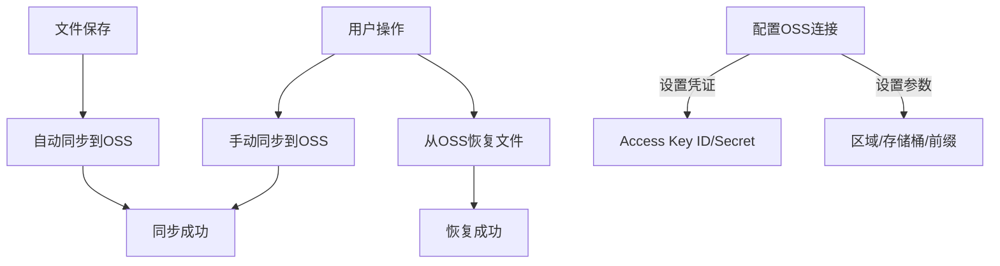

# Obsidian Aliyun Sync Plugin

[English](./README.md) | 中文

本插件允许您将Obsidian笔记与阿里云OSS同步，包括：

- 从阿里云OSS恢复文件到您的仓库
- 手动存储到阿里云OSS
- 文件保存时自动存储

## 功能特性

- 从阿里云OSS恢复文件到您的仓库
- 手动存储文件到阿里云OSS
- 文件保存时自动同步
- 可配置的OSS连接设置
- 支持OSS中的自定义前缀

## 安装方法

1. 从Obsidian社区插件安装
2. 启用插件
3. 在设置中配置您的阿里云OSS凭证

## 使用说明

### 从阿里云OSS恢复

1. 打开命令面板(Ctrl/Cmd+P)
2. 搜索"从阿里云OSS恢复"命令
3. 运行命令恢复您的文件

### 手动同步到阿里云OSS

1. 打开命令面板(Ctrl/Cmd+P)
2. 搜索"同步到阿里云OSS"命令
3. 运行命令存储您的文件

### 自动同步

文件保存时将自动同步到阿里云OSS(可在设置中禁用)

## 配置选项

在插件设置选项卡中配置以下选项：

- Access Key ID: 您的阿里云OSS Access Key ID
- Access Key Secret: 您的阿里云OSS Access Key Secret
- 区域: OSS区域(例如oss-cn-hangzhou)
- 存储桶: 您的OSS存储桶名称
- 端点: 可选自定义端点
- 前缀: OSS对象键的可选前缀

## 系统要求

- Obsidian v0.15.0或更高版本
- 有效的阿里云OSS账户和凭证

## 支持

如有问题或功能请求，请在GitHub上提交issue。
